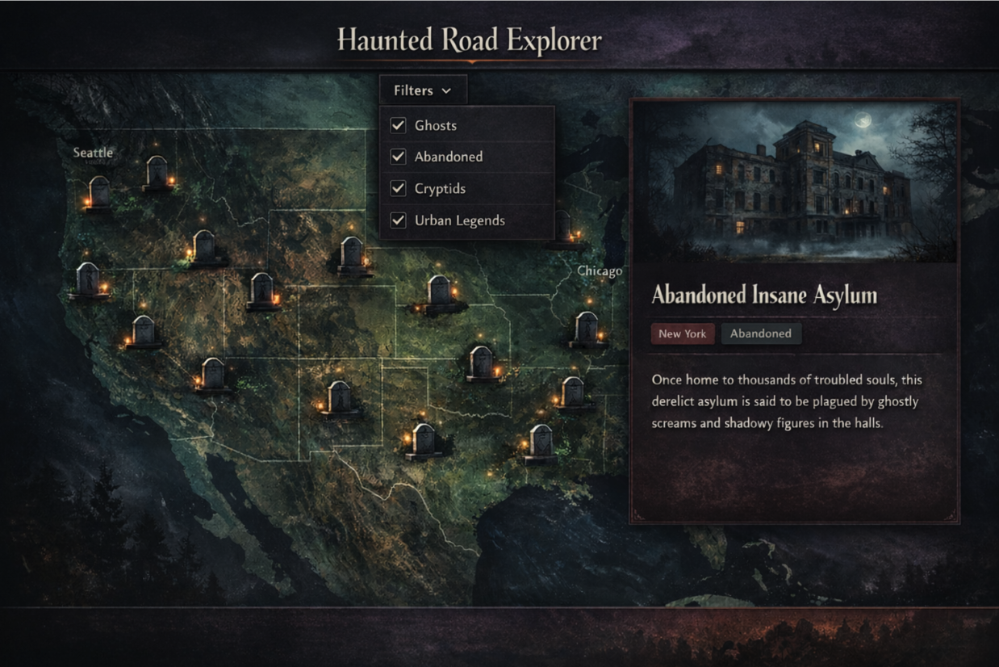
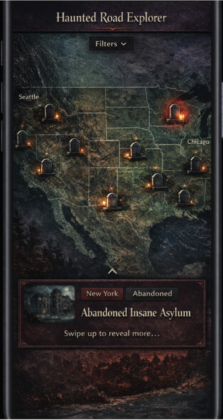

# Haunted Road Atlas

**Haunted Road Atlas** is a story-driven map for discovering haunted locations. Browse eerie places on an interactive map, tap into preview cards, and dive into full story pages with photos, sources, and metadata. It’s built as an open-source monorepo with a web app first, then a React Native mobile app—sharing business logic across platforms.

> **Maps are powered by Mapbox** (Mapbox GL JS on web; Mapbox native SDK on mobile via a RN wrapper).

---

## Design Screenshots

### Web


&nbsp;
&nbsp;

### Mobile



---

## Product Highlights

- **Discoverable by design**

  - Browse by region and zoom level
  - Tap markers for instant preview cards
  - Jump from map → story → back to map context

- **Story-first details**

  - Dedicated location pages with narrative, images, tags, and sources
  - “View on map” actions to refocus the map on a location

- **Atmospheric presentation**

  - Dark-mode styling and custom map theme via Mapbox Studio
  - Custom marker icons (gravestone/bat) and hover/active states

- **Fast with real data**
  - Designed for 1k+ markers with bbox queries + clustering patterns

---

## MVP Feature Set

- Interactive map with haunted locations
- Preview cards on marker selection
- Filters (category multi-select, state/region selectors)
- Basic loading + error handling

---

## Mapbox (What You Need)

To get started with maps:

- **Web:** Mapbox GL JS (renders the map in `apps/web`)
- **Styles:** Mapbox Studio style URL (for the haunted dark theme)
- **Mobile (later):** Mapbox native SDK via a React Native wrapper

You’ll configure:

- `VITE_MAPBOX_ACCESS_TOKEN`
- `VITE_MAPBOX_STYLE_URL`

---

## Monorepo Overview

```
.
├─ apps/
│  ├─ web/                         # React + TS + Vite (Mapbox GL JS)
│  │  ├─ Dockerfile                # Production build
│  │  ├─ Dockerfile.dev            # Development with hot reload
│  │  └─ (vite react app files)
│  └─ mobile/                      # React Native + TS (planned; Mapbox native SDK)
├─ core/                           # Shared TS domain + api client + validation + UI tokens
│  ├─ domain/
│  ├─ api-client/
│  ├─ validation/
│  ├─ ui/
│  └─ utils/
├─ services/
│  └─ api/                         # Go REST API + Postgres (+ PostGIS)
│     ├─ Dockerfile                # Production build
│     ├─ Dockerfile.dev            # Development with Air hot reload
│     ├─ .air.toml                 # Air configuration for hot reload
│     ├─ cmd/
│     ├─ internal/
│     ├─ db/
│     │  └─ migrations/
│     ├─ pkg/
│     ├─ go.mod
│     └─ go.sum
├─ infrastructure/
│  └─ docker/
│     ├─ docker-compose.yml        # postgres + pgadmin + api + web (dev setup)
│     ├─ .env                      # Environment variables (not in git)
│     ├─ .env.example              # Example env file
│     └─ postgres/
│        └─ init/                  # optional init scripts (extensions/roles)
├─ Makefile                        # shortcuts for docker compose commands
└─ package.json                    # Yarn workspaces root
```

---

## Getting Started (Local)

### Prerequisites

- Node.js (LTS recommended)
- Yarn
- Docker + Docker Compose
- Go 1.25+ (for local API development, optional)

### 1) Install dependencies (repo root)

```bash
yarn
```

### 2) Configure environment variables

Create `infrastructure/docker/.env`:

```bash
# Database
POSTGRES_USER=some-user
POSTGRES_PASSWORD=some-password
POSTGRES_DB=some-db

# pgAdmin
PGADMIN_DEFAULT_EMAIL=some-email@some-domain.com
PGADMIN_DEFAULT_PASSWORD=some-password
```

Create `apps/web/.env.local`:

```bash
VITE_MAPBOX_ACCESS_TOKEN=pk.your_token_here
VITE_MAPBOX_STYLE_URL=mapbox://styles/your-user/your-style-id
VITE_API_BASE_URL=http://localhost:8080
```

### 3) Start the development stack

Using Makefile (recommended):

```bash
make up
```

Or directly with Docker Compose:

```bash
docker compose -f infrastructure/docker/docker-compose.yml up -d
```

This starts all services with **hot reload enabled**:

- **PostgreSQL** (port 5432) - Database with PostGIS extension
- **pgAdmin** (port 5050) - Database administration UI
- **API** (port 8080) - Go API with Air hot reload
- **Web** (port 5173) - Vite dev server with HMR

### 4) Access the services

- **Web App**: http://localhost:5173
- **API**: http://localhost:8080
- **pgAdmin**: http://localhost:5050
- **PostgreSQL**: localhost:5432

### 5) Development workflow

The Docker setup is optimized for development with **hot reload**:

- **Web changes** (`apps/web/`): Automatically reflected via Vite HMR
- **API changes** (`services/api/`): Automatically rebuilt and restarted via Air

Make changes to your code and see them update immediately without restarting containers!

---

## Development

### Docker Compose Services

The development stack includes:

| Service    | Port | Description                                |
| ---------- | ---- | ------------------------------------------ |
| `postgres` | 5432 | PostgreSQL database with PostGIS extension |
| `pgadmin`  | 5050 | Web-based PostgreSQL administration tool   |
| `api`      | 8080 | Go REST API with hot reload (Air)          |
| `web`      | 5173 | React + Vite frontend with HMR             |

### Makefile Commands

```bash
make up      # Start all services in detached mode
make down    # Stop all services
make restart # Restart all services
make logs    # View logs from all services (follow mode)
```

### Database Management

**Using pgAdmin:**

1. Open http://localhost:5050
2. Login with credentials from `.env`:
   - Email: `PGADMIN_DEFAULT_EMAIL`
   - Password: `PGADMIN_DEFAULT_PASSWORD`
3. Right-click "Servers" → "Register" → "Server"
4. Connection details:
   - **Host**: `postgres` (Docker service name)
   - **Port**: `5432`
   - **Database**: `POSTGRES_DB`
   - **Username**:`POSTGRES_USER`
   - **Password**: `POSTGRES_PASSWORD`

**Using psql:**

```bash
docker exec -it haunted-road-atlas-db psql -U postgres -d haunted_road_atlas
```

### Hot Reload

Both the web app and API support hot reload:

- **Web**: Vite's HMR automatically updates the browser when you change files in `apps/web/src/`
- **API**: Air watches for changes in `services/api/` and automatically rebuilds and restarts the server

View API rebuild logs:

```bash
docker logs haunted-road-atlas-api -f
```

### Production Builds

Production Dockerfiles are available but not used by default:

- `apps/web/Dockerfile` - Production build with nginx
- `services/api/Dockerfile` - Production Go binary

To use production builds, update `docker-compose.yml` to use `Dockerfile` instead of `Dockerfile.dev`.

---

## API (MVP)

Public endpoints:

- `GET /health`
- `GET /locations?bbox=west,south,east,north&categories=...&state=...&page=...&limit=...`
- `GET /locations/:id`

The UI uses bbox + filters to request only what’s visible on the map.

---

## Product Roadmap (High Level)

**Phase 1 — Web MVP**

- Map + clustering
- Preview card + story page
- Filters + shareable URLs

**Phase 2 — Content pipeline**

- Admin endpoints (create/update locations)
- Simple authoring UI or CMS integration

**Phase 3 — Mobile**

- Map + bottom sheet cards
- Detail screen parity with web
- Shared tokens + API client from `/core`

---

## License (MIT)
